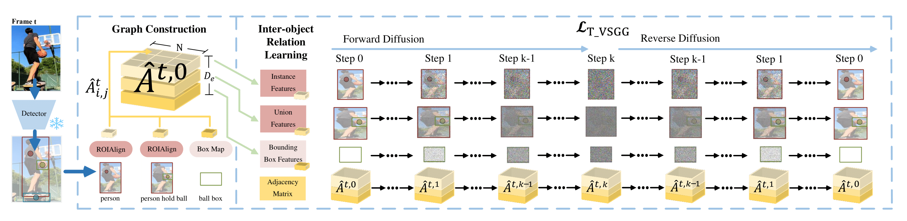

# [DiffVsgg: Diffusion-Driven Online Video Scene Graph Generation)



>[DiffVsgg: Diffusion-Driven Online Video Scene Graph Generation](https://www.arxiv.org/abs/2407.06540) <br>
>[Mu Chen](https://scholar.google.com/citations?user=eyBlZUUAAAAJ&hl=zh-CN), [Liulei Li](https://scholar.google.com/citations?user=eCrBWngAAAAJ&hl=en), [Wenguan Wang](https://sites.google.com/view/wenguanwang), [Yi Yang](https://scholar.google.com/citations?hl=zh-CN&user=RMSuNFwAAAAJ&view_op=list_works)
>

This is the official implementation of "DiffVsgg: Diffusion-Driven Online Video Scene Graph Generation" (Accepted at CVPR 2025).

## Abstract
Top-leading solutions for Video Scene Graph Generation (VSGG) typically adopt an offline pipeline. Though demonstrating promising performance, they remain unable to handle real-time video streams and consume large GPU memory. Moreover, these approaches fall short in temporal reasoning, merely aggregating frame-level predictions over a temporal context. In response, we introduce DiffVsgg, an online VSGG solution that frames this task as an iterative scene graph update problem. Drawing inspiration from Latent Diffusion Models (LDMs) which generate images via denoising a latent feature embedding, we unify the decoding of object classification, bounding box regression, and graph generation three tasks using one shared feature embedding. Then, given an embedding containing unified features of object pairs, we conduct a step-wise Denoising on it within LDMs, so as to deliver a clean embedding which clearly indicates the relationships between objects. This embedding then serves as the input to task-specific heads for object classification, scene graph generation, etc. DiffVsgg further facilitates continuous temporal reasoning, where predictions for subsequent frames leverage results of past frames as the conditional inputs of LDMs, to guide the reverse diffusion process for current frames. Extensive experiments on three setups of Action Genome demonstrate the superiority of DiffVsgg.

## Code

Coming soon...

## Citation

If you find this work useful in your research, please star our repository and consider citing:

```
@inproceedings{chen2025diffvsgg,
  title={DiffVsgg: Diffusion-Driven Online Video Scene Graph Generation},
  author={Chen, Mu and Li, Liulei and Wang, Wenguan and Quan, Ruijie and Yang, Yi},
  year = {2025},
  booktitle = {CVPR},
}
```
## Contact

Any comments, please email: mu.chen@student.uts.edu.au.
